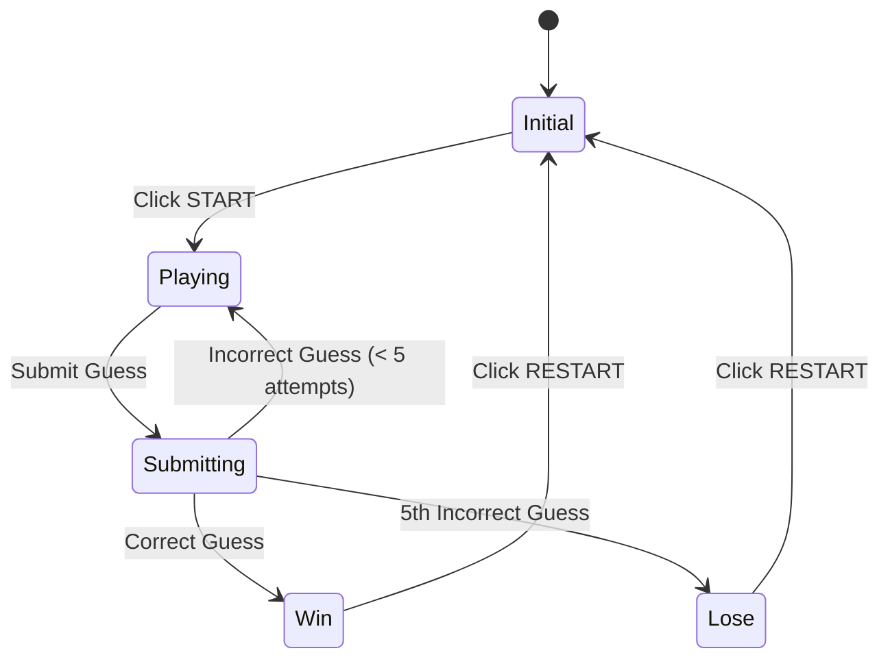

# Guess The Word Game - First Iteration Implementation Plan

## Overview
This is the implementation plan for the first iteration of a word guessing game built with React and Tailwind CSS. The game presents players with hints to guess a secret word, with up to 5 attempts allowed. Key features include:

- Simple, responsive UI that works on both desktop and mobile
- Single-player gameplay with immediate feedback
- Input validation and error handling via toast notifications
- Loading states for async operations
- Centralized client-side state management with Redux Toolkit
- Simulated game logic entirely on the client

The implementation focuses on core gameplay mechanics while keeping the UI clean and minimal. Features like turn counters, keyboard UI, and advanced accessibility are planned for future iterations.

## Game Algorithm

The game follows a simple state machine pattern where each action transitions the game between well-defined states. The core algorithm handles user input validation, guess processing, and game state management.



### Core Algorithm Components:

Game State Management:
- Tracks current game state (initial, playing, submitting, win, lose)
- Maintains arrays of hints and guesses
- Handles state transitions based on user actions and game rules

Input Processing:
- Validates user input against constraints:
  * ASCII characters only (A-Z)
  * Maximum length of 10 characters
  * Case-insensitive comparison
  * No empty submissions
  * No duplicate guesses

Guess Processing:
- Handles guess submission workflow:
  * Updates game state based on guess result
  * Manages hint revelation
  * Tracks guess count
  * Determines win/lose conditions

Error Handling:
- Manages invalid input scenarios:
  * Shows toast for invalid characters
  * Shows toast for duplicate guesses
  * Prevents submissions during loading state

### Implementation Strategy:
1. Implement state machine using React Context
3. Implement input validation as a separate utility
4. Use React hooks for managing component-level state
5. Implement error handling at both UI and data layers

## 1. Project Setup
- [x] Initialize React project with Vite
- [x] Install and configure Tailwind CSS
- [x] Install react-toastify
- [x] Install Redux Toolkit
  ```bash
  npm install @reduxjs/toolkit react-redux
  ```
- [x] Set up basic project structure
  ```
  src/
    components/
    store/
      slices/
        gameSlice.ts
      store.ts
    hooks/
    types/
    utils/
      mockWords.ts
      validation.ts
    App.tsx
    main.tsx
  ```

## 2. State Management Setup
- [x] Create game slice for all game state
  ```typescript
  // src/store/slices/gameSlice.ts
  import { createSlice, PayloadAction } from '@reduxjs/toolkit';
  import { getRandomWord, getHintForWord } from '../utils/mockWords';

  interface GameState {
    state: 'initial' | 'playing' | 'submitting' | 'win' | 'lose';
    currentWord: string;
    hints: string[];
    guesses: string[];
    isInputDisabled: boolean;
    lastError?: string;
  }

  const initialState: GameState = {
    state: 'initial',
    currentWord: '',
    hints: [],
    guesses: [],
    isInputDisabled: false,
  };

  export const gameSlice = createSlice({
    name: 'game',
    initialState,
    reducers: {
      startGame: (state) => {
        const word = getRandomWord();
        state.currentWord = word;
        state.hints = [getHintForWord(word, 0)];
        state.guesses = [];
        state.state = 'playing';
        state.isInputDisabled = false;
        state.lastError = undefined;
      },
      submitGuess: (state, action: PayloadAction<string>) => {
        const guess = action.payload.toUpperCase();
        
        // Handle duplicate guess
        if (state.guesses.includes(guess)) {
          state.lastError = `You already guessed ${guess}. Try again.`;
          return;
        }

        state.guesses.push(guess);
        
        // Check for win
        if (guess === state.currentWord) {
          state.state = 'win';
          state.isInputDisabled = true;
          return;
        }

        // Handle next hint or loss
        if (state.guesses.length === 5) {
          state.state = 'lose';
          state.isInputDisabled = true;
        } else {
          state.hints.push(getHintForWord(state.currentWord, state.hints.length));
        }
      },
      setError: (state, action: PayloadAction<string>) => {
        state.lastError = action.payload;
      },
      clearError: (state) => {
        state.lastError = undefined;
      },
      restartGame: (state) => {
        return initialState;
      }
    },
  });

  export const { startGame, submitGuess, setError, clearError, restartGame } = gameSlice.actions;
  ```

- [x] Create mock words utility
  ```typescript
  // src/utils/mockWords.ts
  const WORDS_WITH_HINTS: Array<[string, string[]]> = [
    ['BREAD', ['GRAIN', 'BUTTER', 'CRUST', 'SLICE', 'BAKER']],
    ['WATER', ['DRINK', 'CLEAR', 'OCEAN', 'THIRST', 'FLUID']],
    // Add more words with their hints
  ];

  export const getRandomWord = () => {
    const randomIndex = Math.floor(Math.random() * WORDS_WITH_HINTS.length);
    return WORDS_WITH_HINTS[randomIndex][0];
  };

  export const getHintForWord = (word: string, hintIndex: number) => {
    const wordEntry = WORDS_WITH_HINTS.find(([w]) => w === word);
    return wordEntry ? wordEntry[1][hintIndex] : '';
  };
  ```

## 3. Core Components Implementation
- [x] Implement base components with Redux hooks:
  - [x] Title component
  - [x] Button component (reusable for START/SUBMIT/RESTART)
  - [x] GuessInput component with validation
    ```typescript
    const GuessInput: React.FC = () => {
      const dispatch = useAppDispatch();
      const { isInputDisabled, state } = useAppSelector(state => state.game);
      const [value, setValue] = useState('');

      const handleSubmit = (e: FormEvent) => {
        e.preventDefault();
        if (isValidGuess(value)) {
          dispatch(submitGuess(value));
          setValue('');
        } else {
          dispatch(setError('Not a valid guess'));
        }
      };

      return (
        <form onSubmit={handleSubmit}>
          {/* form implementation */}
        </form>
      );
    };
    ```
  - [x] HintsList component
  - [x] GuessesList component
  - [ ] LoadingSpinner component (not needed for first iteration)
  - [x] CompletionMessage component (implemented as GameStatus)

## 4. Game Logic Implementation
- [x] Implement input validation utility
  ```typescript
  // src/utils/validation.ts
  export const isValidGuess = (guess: string): boolean => {
    return /^[A-Za-z]{1,10}$/.test(guess);
  };
  ```

## 5. UI Implementation
- [x] Style components with Tailwind CSS
  - [x] Responsive layout (mobile-first)
  - [x] Color scheme for hints/guesses
  - [ ] Loading spinner styling (not needed)
  - [x] Button states (disabled/enabled)

- [x] Configure toast notifications
  ```typescript
  const showToast = (message: string) => {
    toast(message, {
      position: "top-center",
      autoClose: 2000,
      hideProgressBar: true,
    });
  };
  ```

## 6. Game Flow Implementation
- [x] Initial screen with START button
- [x] Main game screen with:
  - [x] Hints/guesses display area
  - [x] Input field and submit button
  - [ ] Loading state handling (not needed for first iteration)
  - [x] Win/lose state handling
  - [x] RESTART button implementation

## Technical Constraints
- Maximum 5 hints and guesses
- Words limited to 10 characters
- ASCII characters only (A-Z, case insensitive)
- Toast notifications visible for 2 seconds
- Portrait orientation for mobile
